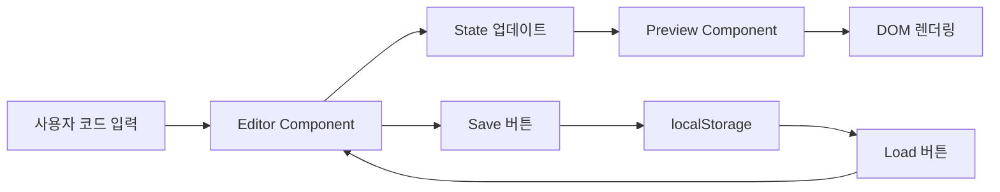

# PRD: Imweb Design Studio (Live Preview)

## 📋 프로젝트 개요

### 프로젝트 명
**Imweb Design Studio** - 실시간 HTML/Tailwind 코드 에디터 & 프리뷰 시스템

### 목적
디자이너와 개발자가 HTML/Tailwind CSS 코드를 작성하고 즉시 결과를 확인할 수 있는 웹 기반 코드 스튜디오를 구축합니다. Imweb 환경을 시뮬레이션하여 디자인 템플릿을 효율적으로 관리하고 테스트할 수 있습니다.

### 핵심 가치
- ⚡ **실시간 피드백**: 코드 작성과 동시에 결과 확인
- 🎨 **디자인 시스템 통합**: Tailwind CSS 기반의 일관된 디자인
- 💾 **템플릿 관리**: 재사용 가능한 디자인 컴포넌트 저장/로드
- 🚀 **빠른 프로토타이핑**: 아이디어를 즉시 시각화

---

## 🎯 비즈니스 목표

### 주요 목표
1. **생산성 향상**: 디자인 작업 시간 50% 단축
2. **협업 강화**: 코드 기반 디자인 공유 및 재사용
3. **품질 향상**: 일관된 디자인 시스템 적용

### 성공 지표
- 템플릿 재사용률 70% 이상
- 평균 프로토타입 제작 시간 30분 이내
- 사용자 만족도 4.5/5.0 이상

---

## 👥 사용자 페르소나

### 1차 타겟: 프론트엔드 개발자
- **니즈**: 빠른 UI 프로토타이핑, 컴포넌트 테스트
- **페인 포인트**: 매번 새 프로젝트 세팅의 번거로움
- **기대 효과**: 즉시 코드 작성 및 결과 확인

### 2차 타겟: UI/UX 디자이너
- **니즈**: 디자인 아이디어의 빠른 시각화
- **페인 포인트**: 코드 없이는 정확한 구현 확인 어려움
- **기대 효과**: 코드 기반 디자인 작업 가능

---

## 🔧 기술 스택

### Frontend Framework
- **Next.js 14** (App Router)
- **TypeScript** - 타입 안정성
- **React 18** - 컴포넌트 기반 UI

### Styling
- **Tailwind CSS** (CDN 방식)
  - Prefix: `dc-` (Design Code)
  - Preflight: `false` (기존 스타일 보호)
- **Custom CSS** - 에디터 및 레이아웃 스타일링

### 상태 관리 & 저장소
- **React Hooks** (useState, useEffect)
- **localStorage** - 템플릿 영구 저장

### 개발 도구
- **Monaco Editor** 또는 **CodeMirror** (선택적)
- **ESLint & Prettier** - 코드 품질 관리

---

## 📐 시스템 아키텍처

### 컴포넌트 구조

```
app/
├── layout.tsx          # Tailwind CDN 주입, 전역 설정
├── page.tsx            # 메인 페이지 (에디터 + 프리뷰)
├── components/
│   ├── Editor.tsx      # 코드 에디터 컴포넌트
│   ├── Preview.tsx     # 실시간 프리뷰 컴포넌트
│   ├── Toolbar.tsx     # 저장/로드 버튼 등
│   └── TemplateManager.tsx  # 템플릿 관리 UI
└── utils/
    └── storage.ts      # localStorage 헬퍼 함수
```

### 데이터 플로우



---

## 🎨 기능 명세

### Phase 1: 핵심 기능 (MVP)

#### 1.1 실시간 코드 에디터
**설명**: 왼쪽 패널에 HTML/Tailwind 코드를 작성할 수 있는 텍스트 에디터

**요구사항**:
- [x] Textarea 또는 Monaco Editor 사용
- [x] 다크 테마 적용 (개발자 친화적)
- [x] 코드 하이라이팅 (선택적)
- [x] 자동 저장 기능 (3초마다 임시 저장)

**UI 스펙**:
- 배경색: `#1e1e1e` (VS Code 다크 테마)
- 폰트: `Fira Code` 또는 `JetBrains Mono`
- 폰트 크기: `14px`
- 라인 넘버 표시

#### 1.2 실시간 프리뷰
**설명**: 오른쪽 패널에 작성한 코드의 실시간 렌더링 결과 표시

**요구사항**:
- [x] 코드 변경 시 즉시 DOM 업데이트
- [x] Tailwind CSS `dc-` prefix 적용
- [x] 흰색 배경 (`#ffffff`)
- [x] 반응형 프리뷰 (선택적: 모바일/태블릿/데스크톱 뷰)

**기술 구현**:
```typescript
// dangerouslySetInnerHTML 사용
<div dangerouslySetInnerHTML={{ __html: userCode }} />
```

> [!WARNING]
> XSS 공격 방지를 위해 추후 sanitization 라이브러리 (DOMPurify) 적용 권장

#### 1.3 스플릿 레이아웃
**설명**: 에디터와 프리뷰를 좌우로 분할

**요구사항**:
- [x] 50:50 비율 (기본값)
- [x] 리사이즈 가능 (선택적)
- [x] 반응형: 모바일에서는 상하 분할

**CSS 구현**:
```css
.container {
  display: grid;
  grid-template-columns: 1fr 1fr;
  height: 100vh;
}

@media (max-width: 768px) {
  .container {
    grid-template-columns: 1fr;
    grid-template-rows: 1fr 1fr;
  }
}
```

---

### Phase 2: 템플릿 관리

#### 2.1 템플릿 저장
**설명**: 현재 작성 중인 코드를 템플릿으로 저장

**요구사항**:
- [x] 저장 버튼 클릭 시 모달 오픈
- [x] 템플릿 이름 입력 (예: "Hero Section", "Card UI")
- [x] localStorage에 JSON 형태로 저장

**데이터 구조**:
```typescript
interface Template {
  id: string;          // UUID
  name: string;        // 사용자 지정 이름
  code: string;        // HTML/Tailwind 코드
  createdAt: number;   // 타임스탬프
  updatedAt: number;
}
```

#### 2.2 템플릿 로드
**설명**: 저장된 템플릿 목록을 보여주고 선택하여 불러오기

**요구사항**:
- [x] 드롭다운 또는 모달 형태
- [x] 템플릿 목록 표시 (이름 + 생성일)
- [x] 선택 시 에디터에 코드 로드
- [x] 미리보기 기능 (선택적)

**UI 플로우**:
1. "Load Template" 버튼 클릭
2. 모달에서 템플릿 목록 표시
3. 템플릿 선택
4. 에디터에 코드 자동 입력
5. 프리뷰 자동 업데이트

#### 2.3 템플릿 삭제
**설명**: 불필요한 템플릿 제거

**요구사항**:
- [x] 템플릿 목록에서 삭제 버튼
- [x] 확인 다이얼로그 표시
- [x] localStorage에서 제거

---

### Phase 3: 추가 기능 (선택적)

#### 3.1 코드 내보내기
- HTML 파일로 다운로드
- 클립보드 복사

#### 3.2 테마 전환
- 라이트/다크 모드
- 커스텀 테마 설정

#### 3.3 협업 기능
- 템플릿 공유 URL 생성
- 클라우드 동기화 (Firebase/Supabase)

---

## 🎨 디자인 가이드라인

### 컬러 팔레트

**에디터 영역** (다크 테마):
- 배경: `#1e1e1e`
- 텍스트: `#d4d4d4`
- 강조: `#569cd6` (키워드)
- 경계선: `#333333`

**프리뷰 영역** (라이트 테마):
- 배경: `#ffffff`
- 경계선: `#e5e5e5`

**UI 요소**:
- 주요 버튼: `#3b82f6` (Tailwind Blue 500)
- 보조 버튼: `#6b7280` (Tailwind Gray 500)
- 위험 버튼: `#ef4444` (Tailwind Red 500)

### 타이포그래피
- **에디터**: Fira Code, 14px, line-height: 1.6
- **UI 텍스트**: Inter, 14px
- **제목**: Inter Bold, 18px

### 레이아웃
- 툴바 높이: `60px`
- 패딩: `16px`
- 버튼 높이: `40px`
- 모달 최대 너비: `600px`

---

## 🔐 보안 고려사항

> [!CAUTION]
> **XSS (Cross-Site Scripting) 방지**

### 현재 위험
- `dangerouslySetInnerHTML` 사용으로 인한 스크립트 주입 가능성

### 해결 방안
1. **DOMPurify 라이브러리 적용**
```typescript
import DOMPurify from 'dompurify';

const sanitizedCode = DOMPurify.sanitize(userCode);
```

2. **CSP (Content Security Policy) 헤더 설정**
```typescript
// next.config.js
const securityHeaders = [
  {
    key: 'Content-Security-Policy',
    value: "script-src 'self' 'unsafe-inline' cdn.tailwindcss.com;"
  }
];
```

3. **사용자 교육**
- 신뢰할 수 없는 코드 실행 주의 안내

---

## 📱 반응형 디자인

### 브레이크포인트
- **모바일**: < 768px
- **태블릿**: 768px ~ 1024px
- **데스크톱**: > 1024px

### 레이아웃 변화
| 디바이스 | 에디터 | 프리뷰 | 툴바 |
|---------|--------|--------|------|
| 모바일 | 상단 50% | 하단 50% | 고정 상단 |
| 태블릿 | 좌측 40% | 우측 60% | 고정 상단 |
| 데스크톱 | 좌측 50% | 우측 50% | 고정 상단 |

---

## 🚀 구현 계획

### Step 1: 프로젝트 초기화
**목표**: Next.js 프로젝트 생성 및 기본 설정

**작업 내용**:
- [x] `npx create-next-app@latest` 실행
- [x] TypeScript 설정
- [x] 폴더 구조 생성
- [x] `layout.tsx`에 Tailwind CDN 주입

**예상 시간**: 30분

### Step 2: 레이아웃 & 에디터 구현
**목표**: 스플릿 레이아웃과 코드 에디터 UI 구축

**작업 내용**:
- [x] `page.tsx`에 그리드 레이아웃 구현
- [x] `Editor.tsx` 컴포넌트 생성
- [x] Textarea 또는 Monaco Editor 통합
- [x] 다크 테마 스타일링

**예상 시간**: 1시간

### Step 3: 실시간 프리뷰 구현
**목표**: 코드 변경 시 즉시 렌더링

**작업 내용**:
- [x] `Preview.tsx` 컴포넌트 생성
- [x] `useState`로 코드 상태 관리
- [x] `dangerouslySetInnerHTML`로 렌더링
- [x] Tailwind `dc-` prefix 테스트

**예상 시간**: 1시간

### Step 4: 템플릿 관리 시스템
**목표**: 저장/로드 기능 구현

**작업 내용**:
- [x] `storage.ts` 유틸리티 함수 작성
- [x] `TemplateManager.tsx` 컴포넌트 생성
- [x] 저장 모달 UI 구현
- [x] 로드 드롭다운/모달 구현
- [x] 삭제 기능 추가

**예상 시간**: 2시간

### Step 5: 검증 & 테스트
**목표**: 기능 동작 확인 및 버그 수정

**작업 내용**:
- [x] 개발 서버 실행 (`npm run dev`)
- [x] 브라우저에서 테스트
  - 샘플 코드 입력: `<div class="dc-text-red-500">Hello</div>`
  - 빨간색 텍스트 렌더링 확인
- [x] 템플릿 저장/로드 테스트
- [x] 스크린샷 촬영

**예상 시간**: 1시간

---

## 🧪 테스트 시나리오

### 기능 테스트

#### TC-01: 실시간 프리뷰
**목적**: 코드 입력 시 즉시 렌더링 확인

**절차**:
1. 에디터에 `<div class="dc-text-blue-500">Test</div>` 입력
2. 프리뷰 영역 확인

**예상 결과**: 파란색 "Test" 텍스트 표시

---

#### TC-02: 템플릿 저장
**목적**: 코드를 템플릿으로 저장

**절차**:
1. 에디터에 코드 작성
2. "Save" 버튼 클릭
3. 템플릿 이름 입력 (예: "Hero Section")
4. 저장 확인

**예상 결과**: localStorage에 템플릿 저장됨

---

#### TC-03: 템플릿 로드
**목적**: 저장된 템플릿 불러오기

**절차**:
1. "Load" 버튼 클릭
2. 템플릿 목록에서 "Hero Section" 선택
3. 에디터 확인

**예상 결과**: 저장된 코드가 에디터에 로드됨

---

#### TC-04: Tailwind Prefix 적용
**목적**: `dc-` prefix가 정상 작동하는지 확인

**절차**:
1. `<div class="dc-bg-red-500 dc-p-4">Box</div>` 입력
2. 프리뷰 확인

**예상 결과**: 빨간 배경에 패딩이 적용된 박스 표시

---

### 브라우저 호환성 테스트
- [x] Chrome (최신 버전)
- [x] Firefox (최신 버전)
- [x] Safari (최신 버전)
- [x] Edge (최신 버전)

---

## 📊 성능 목표

### 로딩 성능
- **초기 로딩 시간**: < 2초
- **코드 입력 → 렌더링**: < 100ms
- **템플릿 로드**: < 500ms

### 최적화 전략
1. **코드 스플리팅**: Next.js 자동 최적화
2. **Debounce**: 코드 입력 시 과도한 렌더링 방지
3. **Lazy Loading**: Monaco Editor 선택 시 동적 로드

---

## 🔄 향후 로드맵

### v1.1 (1개월 후)
- [ ] Monaco Editor 통합 (고급 코드 편집)
- [ ] 코드 자동 완성
- [ ] 에러 하이라이팅

### v1.2 (2개월 후)
- [ ] 클라우드 동기화 (Firebase)
- [ ] 템플릿 공유 기능
- [ ] 협업 모드 (실시간 공동 편집)

### v2.0 (6개월 후)
- [ ] 컴포넌트 라이브러리
- [ ] AI 기반 코드 제안
- [ ] 버전 관리 시스템

---

## 📞 이해관계자

### 개발팀
- **Frontend Lead**: 전체 아키텍처 설계
- **UI/UX Designer**: 인터페이스 디자인
- **QA Engineer**: 테스트 및 품질 보증

### 사용자
- **내부 개발자**: 프로토타이핑 도구로 활용
- **디자이너**: 디자인 시스템 테스트

---

## 📝 용어 정의

| 용어 | 설명 |
|------|------|
| **Live Preview** | 코드 작성과 동시에 결과를 실시간으로 보여주는 기능 |
| **Template** | 재사용 가능한 HTML/CSS 코드 스니펫 |
| **dc- Prefix** | Tailwind CSS 클래스 충돌 방지를 위한 접두사 |
| **Preflight** | Tailwind의 기본 CSS 리셋 (이 프로젝트에서는 비활성화) |
| **localStorage** | 브라우저 로컬 저장소 (템플릿 영구 저장용) |

---

## 🎯 성공 기준

### 기능적 요구사항
- [x] 코드 입력 후 100ms 이내 프리뷰 업데이트
- [x] 템플릿 10개 이상 저장 가능
- [x] 모바일/데스크톱 반응형 지원

### 비기능적 요구사항
- [x] 직관적인 UI (첫 사용자도 5분 내 사용 가능)
- [x] 안정적인 동작 (크래시 없음)
- [x] 빠른 응답 속도 (렌더링 지연 없음)

---

## 📚 참고 자료

### 유사 서비스
- **CodePen**: 온라인 코드 에디터 & 프리뷰
- **JSFiddle**: HTML/CSS/JS 테스트 환경
- **Tailwind Play**: Tailwind CSS 전용 플레이그라운드

### 기술 문서
- [Next.js 14 Documentation](https://nextjs.org/docs)
- [Tailwind CSS CDN](https://tailwindcss.com/docs/installation/play-cdn)
- [Monaco Editor](https://microsoft.github.io/monaco-editor/)

---

## ✅ 체크리스트

### 개발 전 준비
- [ ] PRD 검토 및 승인
- [ ] 디자인 목업 완성
- [ ] 기술 스택 최종 확정

### 개발 중
- [ ] 코드 리뷰 프로세스 수립
- [ ] 일일 진행 상황 공유
- [ ] 주간 데모 세션

### 배포 전
- [ ] 전체 기능 테스트 완료
- [ ] 성능 최적화 완료
- [ ] 문서화 완료 (README, 사용 가이드)

---

**문서 버전**: 1.0  
**작성일**: 2026-02-03  
**최종 수정일**: 2026-02-03  
**작성자**: Senior Frontend Engineer & UI/UX Designer
